# Execution Plan

## Detailed Analysis Summary

### Change Impact Assessment
- **User-facing changes**: Yes - 고객용 주문 UI, 관리자용 대시보드 신규 구축
- **Structural changes**: Yes - 전체 시스템 신규 설계 (NestJS + React + MySQL)
- **Data model changes**: Yes - 전체 데이터 모델 신규 설계 (Store, Table, Menu, Order 등)
- **API changes**: Yes - REST API 전체 신규 설계
- **NFR impact**: Yes - SSE 실시간 통신, JWT 인증, Docker Compose 배포

### Risk Assessment
- **Risk Level**: Medium (신규 프로젝트이므로 기존 시스템 영향 없음, 다만 복잡도 높음)
- **Rollback Complexity**: Easy (Greenfield - 기존 시스템 없음)
- **Testing Complexity**: Moderate (SSE 실시간 통신, 세션 관리 테스트 필요)

## Workflow Visualization

```mermaid
flowchart TD
    Start(["User Request"])
    
    subgraph INCEPTION["🔵 INCEPTION PHASE"]
        WD["Workspace Detection<br/><b>COMPLETED</b>"]
        RA["Requirements Analysis<br/><b>COMPLETED</b>"]
        WP["Workflow Planning<br/><b>IN PROGRESS</b>"]
        US["User Stories<br/><b>EXECUTE</b>"]
        AD["Application Design<br/><b>EXECUTE</b>"]
        UG["Units Generation<br/><b>EXECUTE</b>"]
    end
    
    subgraph CONSTRUCTION["🟢 CONSTRUCTION PHASE"]
        FD["Functional Design<br/><b>EXECUTE</b>"]
        NFRA["NFR Requirements<br/><b>EXECUTE</b>"]
        NFRD["NFR Design<br/><b>EXECUTE</b>"]
        ID["Infrastructure Design<br/><b>EXECUTE</b>"]
        CG["Code Generation<br/><b>EXECUTE</b>"]
        BT["Build and Test<br/><b>EXECUTE</b>"]
    end
    
    Start --> WD
    WD --> RA
    RA --> WP
    WP --> US
    US --> AD
    AD --> UG
    UG --> FD
    FD --> NFRA
    NFRA --> NFRD
    NFRD --> ID
    ID --> CG
    CG -.->|Next Unit| FD
    CG --> BT
    BT --> End(["Complete"])
    
    style WD fill:#4CAF50,stroke:#1B5E20,stroke-width:3px,color:#fff
    style RA fill:#4CAF50,stroke:#1B5E20,stroke-width:3px,color:#fff
    style WP fill:#4CAF50,stroke:#1B5E20,stroke-width:3px,color:#fff
    style AD fill:#FFA726,stroke:#E65100,stroke-width:3px,stroke-dasharray: 5 5,color:#000
    style US fill:#FFA726,stroke:#E65100,stroke-width:3px,stroke-dasharray: 5 5,color:#000
    style UG fill:#FFA726,stroke:#E65100,stroke-width:3px,stroke-dasharray: 5 5,color:#000
    style FD fill:#FFA726,stroke:#E65100,stroke-width:3px,stroke-dasharray: 5 5,color:#000
    style NFRA fill:#FFA726,stroke:#E65100,stroke-width:3px,stroke-dasharray: 5 5,color:#000
    style NFRD fill:#FFA726,stroke:#E65100,stroke-width:3px,stroke-dasharray: 5 5,color:#000
    style ID fill:#FFA726,stroke:#E65100,stroke-width:3px,stroke-dasharray: 5 5,color:#000
    style CG fill:#4CAF50,stroke:#1B5E20,stroke-width:3px,color:#fff
    style BT fill:#4CAF50,stroke:#1B5E20,stroke-width:3px,color:#fff
    style Start fill:#CE93D8,stroke:#6A1B9A,stroke-width:3px,color:#000
    style End fill:#CE93D8,stroke:#6A1B9A,stroke-width:3px,color:#000
    style INCEPTION fill:#BBDEFB,stroke:#1565C0,stroke-width:3px,color:#000
    style CONSTRUCTION fill:#C8E6C9,stroke:#2E7D32,stroke-width:3px,color:#000
    
    linkStyle default stroke:#333,stroke-width:2px
```



### Text Alternative
```
Phase 1: INCEPTION
  - Workspace Detection (COMPLETED)
  - Requirements Analysis (COMPLETED)
  - Workflow Planning (IN PROGRESS)
  - User Stories (EXECUTE)
  - Application Design (EXECUTE)
  - Units Generation (EXECUTE)

Phase 2: CONSTRUCTION (per-unit loop)
  - Functional Design (EXECUTE)
  - NFR Requirements (EXECUTE)
  - NFR Design (EXECUTE)
  - Infrastructure Design (EXECUTE)
  - Code Generation (EXECUTE)
  - Build and Test (EXECUTE)
```

## Phases to Execute

### 🔵 INCEPTION PHASE
- [x] Workspace Detection (COMPLETED)
- [x] Requirements Analysis (COMPLETED)
- [x] Workflow Planning (IN PROGRESS)
- [ ] User Stories - **EXECUTE**
  - **Rationale**: 사용자 요청으로 포함. 고객/관리자 페르소나 정의 및 사용자 시나리오 구체화
- [ ] Application Design - **EXECUTE**
  - **Rationale**: 신규 프로젝트로 컴포넌트 식별, 서비스 레이어 설계, 컴포넌트 간 의존성 정의 필요
- [ ] Units Generation - **EXECUTE**
  - **Rationale**: Backend API, Frontend UI, 데이터 모델 등 다중 컴포넌트로 분해하여 체계적 구현 필요

### Skipped INCEPTION Stages
- Reverse Engineering - **SKIP** (Greenfield 프로젝트)

### 🟢 CONSTRUCTION PHASE (per-unit)
- [ ] Functional Design - **EXECUTE**
  - **Rationale**: 데이터 모델, 비즈니스 로직(주문 생성, 세션 관리, 상태 변경) 상세 설계 필요
- [ ] NFR Requirements - **EXECUTE**
  - **Rationale**: SSE 실시간 통신, JWT 인증, 성능 요구사항 정의 필요
- [ ] NFR Design - **EXECUTE**
  - **Rationale**: NFR 패턴을 실제 설계에 반영 (SSE 구현 패턴, 인증 미들웨어 등)
- [ ] Infrastructure Design - **EXECUTE**
  - **Rationale**: Docker Compose 구성, MySQL 컨테이너, 이미지 저장소 설계 필요
- [ ] Code Generation - **EXECUTE** (ALWAYS)
  - **Rationale**: 실제 코드 구현
- [ ] Build and Test - **EXECUTE** (ALWAYS)
  - **Rationale**: 빌드 및 테스트 검증

### 🟡 OPERATIONS PHASE
- [ ] Operations - **PLACEHOLDER**

## Success Criteria
- **Primary Goal**: 테이블오더 MVP 서비스 구축 (고객 주문 + 관리자 모니터링)
- **Key Deliverables**:
  - NestJS Backend API (인증, 메뉴, 주문, 테이블 관리, SSE)
  - React Frontend (고객용 주문 UI + 관리자용 대시보드)
  - MySQL 데이터베이스 스키마
  - Docker Compose 배포 설정
- **Quality Gates**:
  - 고객이 메뉴 조회 → 장바구니 → 주문 생성 플로우 완료
  - 관리자가 실시간 주문 모니터링 및 상태 변경 가능
  - 테이블 세션 관리 (시작/종료) 정상 동작
  - SSE 실시간 업데이트 2초 이내 반영
